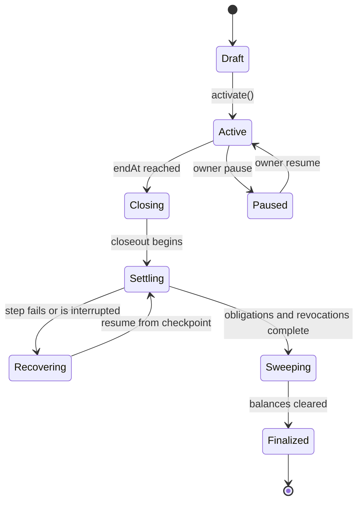
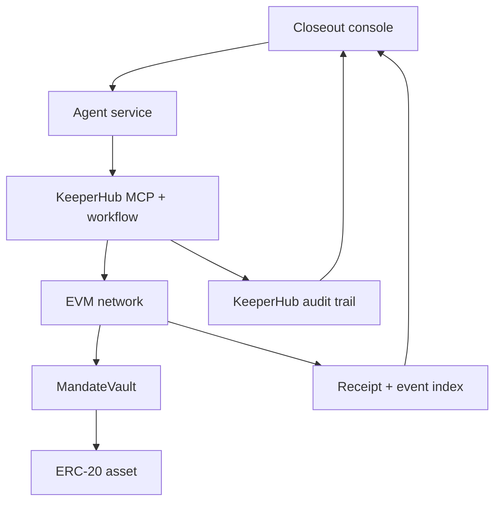
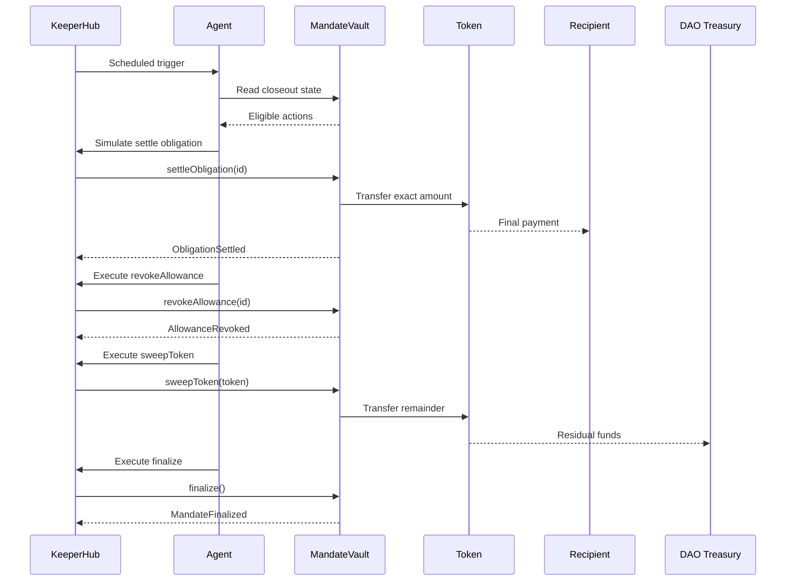

# Mandate Closeout Agent

## Authoritative Hackathon Build Blueprint

**Status:** Working Sepolia implementation deployed and independently verified  
**Mode:** Strengthen and architect  
**Hackathon:** KeeperHub — Agents Onchain  
**Submission deadline:** August 13, 2026, 12:00 UTC+2 / 11:00 Africa/Lagos  
**Working title:** Mandate Closeout Agent. This is not the final product name.

---

## 1. Decision summary

### Recommended concept

Build an autonomous closeout agent for DAO programs, grant committees, and time-bounded treasury mandates.

When a mandate expires, the agent:

1. reads the mandate's authoritative onchain state;
2. determines which pre-authorized obligations remain;
3. executes those obligations through KeeperHub;
4. revokes obsolete token allowances;
5. returns every unreserved asset to the predefined treasury;
6. finalizes the mandate and removes its own execution authority; and
7. exposes transaction and KeeperHub audit evidence for every step.

### Why this advances

- The underlying operational problem is documented by DAO participants and governance policies.
- It creates a distinctive transaction sequence rather than another recommendation-only agent.
- KeeperHub is essential to the product's execution, retry, simulation, gas, routing, and audit story.
- The agent can be powerful without being trusted with arbitrary discretion over funds.
- The complete differentiator can be demonstrated in roughly 90 seconds.
- The smallest credible version is realistic for one builder within the remaining hackathon window.

### Confidence

**Product confidence: medium-high.** The problem and wedge are defensible.

**Implementation confidence: medium until the technical spike passes.** The first task must prove that the KeeperHub wallet can call the custom contract on the selected testnet and expose sufficient execution/audit evidence.

### Largest unknown

The exact KeeperHub testnet wallet, workflow, direct-contract-write, retry, and audit behavior must be verified against the live service. No frontend work should begin before one KeeperHub-executed test transaction succeeds.

---

## 2. Hackathon constraints

### Mandatory

- Use KeeperHub as the onchain execution layer.
- Ship a working agent.
- Submit a public source repository.
- Submit a short demo video.
- Link at least one transaction the agent executed through KeeperHub.
- Be prepared for a finalist live pitch.

### Judging priorities

1. Real onchain execution through KeeperHub
2. Use of KeeperHub surfaces
3. Reliability and observability
4. Originality and real-world usefulness
5. Integration quality and developer experience

### Build assumptions

- Solo-builder plan unless changed later.
- One EVM testnet for the hackathon build.
- One ERC-20 asset in the core demo.
- A custom mandate vault rather than production Safe integration.
- Required obligations only in the MVP. Every obligation must be paid or explicitly cancelled by governance before finalization.
- No dependency on governance forums, KYC systems, bridges, or price oracles in the must-work path.

---

## 3. Problem Evidence Ledger

| Claim | Status | User | Evidence | Strength | Contradictions / limits | Unknown |
|---|---|---|---|---|---|---|
| DAO multisig operations experience delays caused by unclear responsibilities and unavailable signers. | Observed | DAO operations leads and multisig signers | Arbitrum MSS post-mortem reports coordination issues, missing signers, unclear workflows, and slow 9/12 signing. | Strong | One DAO program does not prove identical pain across every DAO. | Frequency across smaller DAOs |
| Payment and reporting processes for funded programs are not consistently standardized. | Observed | DAO program managers | Arbitrum MSS post-mortem explicitly calls out varied payment requests and inconsistent forum reporting. | Strong | Mature DAOs may already have internal processes. | Willingness to adopt an external tool |
| Returning or reallocating leftover program funds can require manual investigation and new governance coordination. | Observed | Program managers and treasury operators | An Arbitrum delegate documented difficulty calculating remaining funds because team members were unavailable, leading to a return-or-new-vote decision. | Medium-high | A predefined policy cannot resolve every exceptional case. | How often closeouts contain disputed obligations |
| Governance organizations consider multisig dissolution a distinct security and accountability operation. | Observed | Governance councils | Optimism's multisig policy explicitly covers operating and dissolving council-managed multisigs. | Strong | The policy does not prescribe autonomous execution. | Which closeout controls DAOs would delegate |
| Cross-chain signer administration produces inconsistent-state and coordination risk. | Observed | Multichain Safe operators | An Optimism mission request describes signer replacement across chains as costly, slow, and vulnerable to inconsistent states. | Strong | Cross-chain execution is excluded from the MVP. | Whether it becomes the best post-hackathon expansion |
| A narrowly permissioned closeout agent could reduce routine coordination without replacing governance. | Inferred | DAO operations leads | Follows from the documented need for standard processes and the ability to encode recipients, limits, and deadlines onchain. | Medium | Governance teams may prefer manual signing for all treasury movement. | Actual delegation appetite |
| Users will pay for this product. | Unknown | DAOs and service providers | No pricing or purchasing evidence collected. | None | Operational usefulness does not establish willingness to pay. | Buyer, budget, pricing model |

### Evidence sources

- [Arbitrum MSS post-mortem](https://forum.arbitrum.foundation/t/mss-for-arbitrum-communication-thread-arbitrum-multisig-support-service/26508/34)
- [Arbitrum leftover-funds discussion](https://forum.arbitrum.foundation/t/jojo-delegate-communication-thread/24429)
- [Optimism Collective Multisig Security Policy](https://gov.optimism.io/t/optimism-collective-multisig-security-policy-v1/9541)
- [Optimism cross-chain key-management mission](https://gov.optimism.io/t/closed-governance-fund-mission-request-cross-chain-key-management-for-safe/10294)

### Required post-hackathon validation

Interview at least:

- two DAO program managers;
- two treasury or multisig operators; and
- one governance service provider.

Ask them to walk through the last real program closeout, including who found balances, who approved destinations, what remained unresolved, how long it took, and what authority they would safely delegate.

---

## 4. Opportunity and collision analysis

### Candidate comparison

Scores use a 1–5 scale and reflect current evidence, not market certainty.

| Candidate | Pain | Urgency | Web3 | Originality | KeeperHub fit | Demo | Buildability | Product potential | Decision |
|---|---:|---:|---:|---:|---:|---:|---:|---:|---|
| Mandate Closeout Agent | 4.5 | 4 | 5 | 4.5 | 5 | 5 | 4 | 4 | Advance |
| Cross-chain signer rotation agent | 4 | 4 | 5 | 4 | 4.5 | 4 | 2 | 4.5 | Defer |
| Protocol incident responder | 5 | 5 | 5 | 2 | 5 | 5 | 3 | 5 | Reject: direct incumbent collision |
| Wallet approval guardian | 5 | 5 | 5 | 1.5 | 5 | 5 | 4 | 4 | Reject: direct product and submission collision |
| DeFi rebalancing agent | 4 | 4 | 4 | 1 | 5 | 4 | 4 | 4 | Reject: saturated and already submitted |
| Grant milestone payout agent | 4 | 4 | 5 | 2 | 5 | 4 | 3 | 4 | Reject: generic escrow/evaluation pattern |

### Originality Map

| Comparable | What it does | Collision | Our wedge | Remaining risk |
|---|---|---|---|---|
| RebalanceKeeper | Autonomous Aave position monitoring and rebalancing via KeeperHub | Category only | DAO mandate closure rather than investment management | Judges may still group both as treasury automation |
| KeeperHub Sentinel | Applies wallet policies before autonomous execution | Surface/category | Executes a complete lifecycle closeout under precommitted mandate rules | Another entrant could submit a similar treasury guardian |
| Revoke.cash Auto-Revoking | Monitors and automatically revokes risky token approvals | Surface | Revocation is one closeout step, not the product | Avoid presenting revocation as the central innovation |
| Hypernative automated response | Detects threats and automatically pauses or protects protocols | Category | Planned administrative closure, not emergency security response | Do not drift into exploit detection |
| Safe modules and Roles | Delegated permissions for multisig operations | Enabling infrastructure | Time-bounded closeout state machine plus autonomous reliable execution | Production buyers may prefer a Safe-native module |
| Generic grant escrow agents | Evaluate milestones and release funds | Category | No subjective milestone judgment; settles only obligations approved before closeout | Messaging must avoid “AI decides who deserves payment” |

### Selected wedge

**A lifecycle-completion agent for time-bounded onchain mandates.**

The product is not “AI manages a treasury.” Its job begins when ordinary program activity ends. It proves that a mandate can terminate cleanly:

- no stranded funds;
- no forgotten obligations;
- no obsolete allowances;
- no lingering executor authority; and
- a public, resumable record of every closeout action.

---

## 5. Web3 necessity and onchain boundary

| Question | Conventional system | Onchain system | User-visible difference |
|---|---|---|---|
| Who controls the funds? | Organization or payment processor | Mandate contract under predefined permissions | Operators cannot silently redirect closeout funds |
| Who verifies completion? | Internal records and reports | Public contract state, events, and transaction receipts | Any stakeholder can verify the closeout |
| How are limits enforced? | Application and staff process | Contract-enforced recipients, caps, time windows, and state transitions | A compromised or hallucinating agent cannot exceed its authority |
| What happens after operator turnover? | Knowledge may leave with staff | Rules and completion state persist onchain | Closeout does not depend entirely on one person remaining available |
| Can a database replace it? | Yes for workflow tracking | No for custody, settlement, and independently verifiable constraints | The differentiator is enforceable asset movement, not task tracking |

### Onchain

- Asset custody
- Mandate configuration hash and core parameters
- Approved obligations and maximum amounts
- Treasury return address
- Executor permissions
- Closeout state
- Step completion and idempotency
- Transfers, allowance revocation, and finalization
- Events required for independent verification

### Offchain

- Agent orchestration
- Human-readable plan and explanations
- KeeperHub API/MCP communication
- Indexed activity feed
- Non-authoritative labels and metadata
- UI state and cached transaction details
- Demo narration and reports

### Critical boundary

The model never decides:

- a new recipient;
- a larger amount;
- a new token;
- a different treasury destination;
- an arbitrary contract call; or
- whether to bypass an unresolved obligation.

These values are fixed or capped by the mandate contract before the agent receives authority.

---

## 6. Product contract

### Target user

Primary:

- DAO operations lead
- Grants-program manager
- Treasury working group
- Governance service provider managing time-bounded programs

Secondary:

- Community member auditing program completion
- Recipient verifying final payment

### Excluded users

- Retail users seeking general wallet protection
- Active traders or yield managers
- Organizations requiring private, reversible bank payments
- Security teams seeking exploit detection
- Programs with unresolved legal disputes or subjective payment decisions

### Core job

“When this mandate ends, settle every obligation already authorized, remove residual permissions, return the remainder, and prove that nothing was left open.”

### Success condition

A mandate is successfully closed only if:

1. the closeout time has passed;
2. every required obligation is paid, cancelled by governance, or explicitly marked not due under contract rules;
3. every registered allowance is zero;
4. every tracked asset balance is zero, except explicitly permitted dust;
5. remaining assets reached the configured treasury;
6. the executor can no longer perform closeout actions; and
7. `MandateFinalized` has been emitted.

### Actors and permissions

| Actor | Allowed | Forbidden |
|---|---|---|
| Governance owner | Configure mandate before activation, cancel obligations under policy, pause agent, replace executor, emergency recover | Rewrite history or alter paid obligations |
| KeeperHub executor | Execute only eligible obligation, revocation, sweep, and finalize functions | Add recipients, increase amounts, redirect treasury, arbitrary call |
| Recipient | Receive approved payment | Modify mandate |
| Treasury | Receive residual assets | Pull funds before closeout |
| Public observer | Read all state and evidence | Mutate state |

### State machine



`Closing` is derived from time and active status. `Settling`, `Recovering`, and `Sweeping` are represented through emitted steps and remaining work rather than unnecessary permanent enum values if the simpler contract design is safer.

### Mandate lifecycle

1. Governance deploys the vault.
2. Governance registers the asset, treasury, end time, grace period, executor, obligations, and allowances.
3. Governance funds the vault.
4. Governance activates it; economic configuration becomes immutable except for explicit pause/cancel controls.
5. KeeperHub checks eligibility on schedule.
6. At `endAt`, the agent reads a closeout snapshot and creates an ordered plan.
7. KeeperHub simulates each next valid transaction.
8. The agent submits one transaction at a time.
9. Confirmed events become durable checkpoints.
10. Failed or interrupted execution resumes by reading current state.
11. After obligations and revocations are complete, residual funds return to the treasury.
12. The agent finalizes the mandate and loses executor authority.

---

## 7. Smart contract specification

### Contract set

#### `MandateVault.sol`

One production-facing contract for the MVP.

Optional testing contracts:

- `MockUSDC.sol`
- `MockSpender.sol`

No upgradeable proxy in the hackathon version.

### Core data

```solidity
enum ObligationStatus {
    Pending,
    Paid,
    Cancelled
}

struct Obligation {
    address recipient;
    address token;
    uint128 amount;
    uint64 dueAt;
    ObligationStatus status;
}

struct AllowanceTarget {
    address token;
    address spender;
    bool revoked;
}
```

Contract storage:

- `address owner`
- `address executor`
- `address treasury`
- `uint64 endAt`
- `uint64 gracePeriod`
- `bool active`
- `bool paused`
- `bool finalized`
- obligation array or mapping
- allowance-target array or mapping
- tracked-token set
- completed step identifiers if needed beyond status fields

### Functions

#### Governance configuration

- `addObligation(recipient, token, amount, dueAt)`
- `addAllowanceTarget(token, spender)`
- `addTrackedToken(token)`
- `activate()`
- `pause()`
- `resume()`
- `cancelObligation(id, reasonHash)`
- `replaceExecutor(newExecutor)` while not finalized
- `requestEmergencyRecovery(token, recipient)` only while paused
- `executeEmergencyRecovery(requestId)` only after a fixed delay

#### Executor functions

- `settleObligation(id)`
- `revokeAllowance(targetId)`
- `sweepToken(token)`
- `finalize()`

#### Read functions

- `isCloseoutEligible()`
- `getNextActions()`
- `unresolvedRequiredObligations()`
- `unrevokedAllowanceCount()`
- `trackedBalance(token)`
- `canFinalize()`

### Exact behavioral rules

#### `settleObligation(id)`

Requirements:

- caller is current executor;
- contract is active and not paused/finalized;
- `block.timestamp >= endAt`;
- obligation is pending;
- `block.timestamp >= dueAt`;
- vault holds sufficient token balance.

Effects:

- mark obligation paid before transfer;
- transfer exactly the registered amount to exactly the registered recipient;
- emit `ObligationSettled`.

Use `SafeERC20`.

#### `revokeAllowance(targetId)`

Requirements:

- caller is executor;
- closeout is eligible;
- target is not already marked revoked.

Effects:

- call OpenZeppelin v5 `SafeERC20.forceApprove(spender, 0)`;
- verify resulting allowance is zero;
- mark revoked;
- emit `AllowanceRevoked`.

The contract must own the allowance being revoked. The demo must create a real non-zero allowance during setup using a standard ERC-20 approval. Permit, Permit2, operator approvals, and protocol-specific permission systems are explicitly outside the MVP.

If zeroing the allowance fails or the post-call allowance remains non-zero, the transaction reverts, the target remains unresolved, and sweeping/finalization remain blocked. The agent surfaces a human-action-required state rather than claiming recovery.

#### `sweepToken(token)`

Requirements:

- caller is executor;
- all required obligations for that token are resolved;
- all registered allowance targets for that token are revoked;
- token is tracked;
- treasury is non-zero.

Effects:

- transfer full remaining balance to the immutable treasury;
- emit `ResidualSwept`.

No arbitrary amount or destination parameter.

#### `finalize()`

Requirements:

- all required obligations resolved;
- all allowances revoked;
- every tracked token balance is zero or below a documented dust threshold;
- not already finalized.

Effects:

- `finalized = true`;
- `active = false`;
- store the old executor for the event;
- `executor = address(0)`;
- emit `MandateFinalized`.

### Events

- `MandateActivated(endAt, treasury, executor)`
- `MandatePaused(by)`
- `MandateResumed(by)`
- `ObligationAdded(id, recipient, token, amount, dueAt)`
- `ObligationCancelled(id, reasonHash)`
- `ObligationSettled(id, recipient, token, amount)`
- `AllowanceTargetAdded(id, token, spender)`
- `AllowanceRevoked(id, token, spender)`
- `ResidualSwept(token, treasury, amount)`
- `ExecutorReplaced(previousExecutor, newExecutor)`
- `EmergencyRecoveryRequested(requestId, token, recipient, executeAfter)`
- `EmergencyRecoveryExecuted(requestId, token, recipient, amount, requester, executor)`
- `MandateFinalized(previousExecutor, finalizedAt)`

### Invariants

- A paid obligation can never be paid twice.
- The executor cannot create or enlarge obligations.
- Residual assets can only be swept to the configured treasury.
- Finalization is impossible while a required obligation remains pending.
- Finalization is impossible while a registered allowance remains non-zero.
- No executor action is possible after finalization.
- Pausing prevents all executor writes.
- A failed transaction cannot create a partially marked successful step.
- Re-reading state is sufficient to resume after interruption.

### Disputes

The MVP does not adjudicate disputes.

Governance must pause the mandate and either:

- cancel an obligation using its pre-existing authority and publish a reason hash; or
- resolve the dispute outside the system before closeout continues.

The agent cannot decide that a recipient should lose an approved payment.

### Break-glass emergency recovery

Emergency recovery is an owner-only exception, not an agent capability.

For the MVP it uses a two-step process:

1. while paused, governance calls `requestEmergencyRecovery(token, recipient)`;
2. the contract emits `EmergencyRecoveryRequested` with an execution timestamp;
3. after a fixed delay, governance calls `executeEmergencyRecovery(requestId)`; and
4. the contract emits a high-visibility `EmergencyRecoveryExecuted` event containing the token, recipient, amount, requester, and executor.

The delay prevents one mistaken transaction from immediately bypassing normal closeout rules. This path is excluded from the happy-path demo and documented as a break-glass control.

---

## 8. Agent specification

### Agent responsibilities

- Poll or receive a scheduled KeeperHub trigger.
- Read contract configuration and current state.
- Determine whether closeout is eligible.
- Build an ordered list using only contract-reported eligible actions.
- Explain why each step is required.
- Request KeeperHub simulation and execution.
- Wait for confirmed outcome before moving to the next dependent step.
- Re-read state after every result.
- Resume from the first incomplete step after interruption.
- Stop and surface a human-action state when contract invariants prevent progress.

### Decision policy

Priority:

1. stop if paused or finalized;
2. stop if closeout is not yet eligible;
3. settle due required obligations;
4. stop if any required obligation is neither payable nor cancelled;
5. revoke all registered allowances;
6. sweep each tracked asset;
7. finalize.

The contract remains authoritative if the agent's plan disagrees with chain state.

### Model use

Acceptable:

- Explain closeout state in plain language.
- Summarize blockers.
- Translate events into a readable audit narrative.
- Select from contract-returned eligible actions.

Not acceptable:

- Freeform transaction construction.
- Recipient extraction from forum posts.
- Subjective milestone assessment.
- New amount calculation outside contract rules.
- Circumventing a failed simulation.

### Idempotency

- Every step has an onchain status or deterministically derived identifier.
- The agent never treats a submitted hash as completion; it requires a confirmed receipt and expected event.
- After submission, the agent waits for a receipt and then re-reads contract state.
- If the expected state already exists, it advances even if the local process missed the receipt notification.
- If the expected state does not exist, it queries the KeeperHub run status before doing anything else.
- While KeeperHub reports the run as pending, submitted, or retrying, the agent does not resubmit.
- If KeeperHub reports terminal failure and chain state remains unchanged, the agent may begin a new attempt with a new run reference.
- If KeeperHub status is unavailable or ambiguous, the agent reconciles by transaction hash, nonce, receipt, and contract state instead of guessing.
- Duplicate execution attempts must revert safely or become no-ops without duplicate payment.

### Recovery demonstration

Use a controlled provider interruption rather than manufacturing an onchain failure:

1. submit a valid transaction through KeeperHub;
2. temporarily disconnect the agent's read provider or stop the agent process;
3. allow the transaction to confirm;
4. restore the provider or restart the process; and
5. show the agent re-reading contract state and advancing without resubmitting the mined action.

This proves stateless recovery. It must not be described as a KeeperHub retry unless the KeeperHub audit record actually shows one.

---

## 9. KeeperHub integration

### Essential surfaces

| KeeperHub surface | Product role | Visible proof |
|---|---|---|
| MCP server | Agent discovers, creates, executes, and monitors the workflow | MCP calls and workflow identity in developer evidence |
| Scheduled trigger | Starts eligibility checks without a human click | Scheduled run in audit view |
| Contract reads | Retrieves mandate state and next eligible action | Read results represented in the plan |
| Contract writes | Executes settle, revoke, sweep, and finalize | Explorer transaction links |
| Simulation | Prevents ineligible or reverting actions from submission | Deliberate premature-closeout rejection |
| Smart gas estimation | Prices closeout transactions | KeeperHub execution detail |
| Retry/monitoring | Recovers from transient execution or delivery problems | Audit record or controlled recovery test |
| Audit trail | Connects trigger, simulation, submission, gas, receipt, and outcome | Product timeline and submission evidence |
| Private routing | Protects value-moving closeout transactions where supported | Configuration and KeeperHub execution evidence |

### Integration classification

**Essential.** Removing KeeperHub breaks the reliable autonomous execution and audit mechanism that distinguishes the product.

### Technical spike acceptance test

Before building the product:

1. Confirm the currently supported testnet for direct custom-contract writes with the live KeeperHub service and documentation. Sepolia is the leading candidate, not an assumption.
2. Deploy a minimal `Counter` or stripped-down `MandateVault` to that network.
3. Connect the KeeperHub hosted MCP server.
4. Resolve or create a KeeperHub wallet.
5. Authorize that wallet as executor.
6. Read contract state through KeeperHub.
7. Submit a deliberately invalid or premature write and inspect the simulation result.
8. Record whether KeeperHub exposes the revert reason, raw error, gas estimate, and a clear “not submitted” outcome.
9. If KeeperHub simulation is insufficient, add a local `eth_call` preflight as a secondary guard while keeping KeeperHub as the only submission path.
10. Execute one valid contract write through KeeperHub.
11. Capture the workflow ID, run ID, transaction hash, receipt, event, gas data, and audit information.
12. Query the run after submission and confirm that its terminal status is retrievable through an API or MCP surface.
13. Confirm the transaction is attributable to the KeeperHub execution path.

If this fails, stop and resolve it with KeeperHub support before product implementation.

---

## 10. System architecture



### Trust boundaries

- **Governance boundary:** Only the owner configures economic authority.
- **Agent boundary:** The model proposes only actions exposed as valid by deterministic code.
- **KeeperHub boundary:** KeeperHub submits and monitors transactions but cannot bypass contract permissions.
- **Chain boundary:** Contract state and confirmed receipts are authoritative.
- **Frontend boundary:** The interface is explanatory, never authoritative for completion.

### Suggested stack

- Contracts: Solidity, Foundry, OpenZeppelin `SafeERC20`
- Agent service: TypeScript/Node
- KeeperHub: hosted MCP server and workflow execution
- Frontend: Next.js, TypeScript, wagmi/viem for reads
- Indexing: direct RPC/event queries for MVP; no external indexer required
- Testing: Foundry plus service-level integration tests
- Deployment: one supported EVM testnet and a web host

### Data ownership

No database is required for authoritative state.

Optional local persistence may store:

- friendly mandate name;
- execution-plan snapshots;
- KeeperHub run identifiers;
- cached transaction metadata; and
- UI preferences.

Deleting the database must not prevent reconstruction of closeout status from chain and KeeperHub evidence.

---

## 11. Transaction sequence



### Confirmation rule

The agent advances only when:

- the receipt is successful;
- the expected event exists;
- event arguments match the intended obligation or target; and
- a fresh state read confirms completion.

---

## 12. Experience specification

### Product surfaces

#### 1. Mandate overview

- Program name
- Lifecycle status
- End-time countdown
- Vault balance
- Treasury destination
- Executor identity
- Obligations resolved / total
- Allowances revoked / total
- KeeperHub workflow health

#### 2. Closeout plan

- Ordered steps
- Reason for each step
- Exact token, amount, and destination
- Contract-enforced constraint badge
- Simulation result
- Current transaction state

#### 3. Live execution

- Trigger received
- State inspected
- Simulation running
- Transaction submitted
- Confirmation pending
- Event verified
- Step complete
- Recovery or human action required

#### 4. Audit and proof

- KeeperHub run reference
- Transaction hashes
- Gas used
- Timestamps
- Expected and observed events
- Explorer links
- Final closeout summary

#### 5. Final certificate

Not an NFT. A verifiable completion view showing:

- all obligations resolved;
- all registered allowances zero;
- vault balances zero;
- residual amount returned;
- executor removed;
- finalization transaction.

### Required UI states

- Loading
- Empty mandate
- Active before expiry
- Closeout eligible
- Simulation rejected
- Awaiting execution
- Submitted
- Confirming
- Confirmed
- Interrupted/recovering
- Blocked by unresolved obligation
- Paused by governance
- Finalized

### Visual direction

The visual identity is intentionally deferred to the frontend and brand skills.

Product-specific art direction should emphasize:

- closure rather than generic “AI intelligence”;
- a finite sequence collapsing toward zero;
- balances, permissions, and obligations visibly clearing;
- calm operational confidence rather than trading-terminal noise; and
- a final state that feels irreversible and complete.

Avoid:

- neon purple AI gradients;
- glowing robot heads;
- generic orbital particles;
- decorative network meshes;
- excessive cards;
- fake analytics; and
- motion that obscures transaction evidence.

### Accessibility

- Never communicate transaction state through color alone.
- Respect reduced-motion preferences.
- Keep transaction hashes and addresses copyable.
- Use readable contrast and minimum 44px interactive targets.
- Provide explicit text for pending, failed, and completed states.

---

## 13. Scope

### Must work

- Deploy one `MandateVault`.
- Configure one treasury, one executor, one tracked token, two obligations, and one allowance target.
- Fund the vault.
- Trigger closeout after `endAt`.
- Execute at least:
  - one obligation payment;
  - one allowance revocation;
  - one residual sweep; and
  - one finalization transaction.
- Execute those writes through KeeperHub.
- Prevent premature closeout.
- Prevent duplicate payment.
- Resume correctly from confirmed onchain state.
- Display KeeperHub and explorer evidence.
- Publish repository, demo video, and transaction links.

### Should work

- Governance pause and resume
- Cancelled-obligation branch
- Multiple tracked tokens
- Human-readable closeout report
- Controlled interrupted-run recovery demonstration
- Automated deployment and seeding script
- One-command demo reset using a fresh vault

### Could work

- Safe module adapter
- Cross-chain mandate inventory
- Program templates
- x402-paid public closeout workflow
- Exported audit report
- Open-source starter template targeting the onboarding bounty

### Explicitly excluded

- Production mainnet custody
- Cross-chain messaging
- Arbitrary Safe transactions
- DAO voting
- KYC/KYB automation
- Milestone quality assessment
- Price-based asset conversion
- Yield management
- Exploit detection
- Dispute adjudication
- LLM-generated transaction destinations or amounts

---

## 14. Security, reliability, and privacy

### Security controls

- Least-privilege executor
- Immutable treasury after activation
- Amount and recipient fixed per obligation
- Checks-effects-interactions
- `SafeERC20`
- Reentrancy guard where appropriate
- Pause switch
- No upgradeability in MVP
- No arbitrary external call
- No delegatecall
- No model-controlled calldata
- Explicit event for every owner exception

### Reliability controls

- Idempotent state transitions
- One dependent write at a time
- Receipt plus event plus state verification
- Resume from chain, not agent memory
- Simulation before every write
- Retry only after checking transaction and contract state
- RPC fallback for reads
- Demo reset using a fresh deployment

### Privacy

All mandate financial state in the MVP is public.

Do not store:

- private recipient information;
- contracts or invoices;
- KYC data;
- private governance discussions; or
- secrets in the frontend or repository.

---

## 15. Testing strategy

### Contract unit tests

- Activation requires complete configuration.
- Configuration freezes after activation.
- Early settlement fails.
- Unauthorized caller fails.
- Paused executor action fails.
- Exact obligation amount reaches exact recipient.
- Duplicate obligation payment fails.
- Revocation sets allowance to zero.
- Sweep fails while required obligation is pending.
- Sweep fails while allowance remains.
- Sweep always uses configured treasury.
- Finalize fails with balance, allowance, or obligation remaining.
- Finalization removes executor.
- All executor actions fail after finalization.
- `forceApprove` revocation succeeds and the post-call allowance is zero.
- Revocation failure leaves the target unresolved and blocks sweep/finalization.
- Emergency recovery cannot execute while unpaused or before its delay.
- Emergency request and execution emit complete evidence.

### Invariant and fuzz tests

- Recipient never receives more than approved amount.
- Treasury destination never changes after activation.
- Sum of successful obligation payments per ID never exceeds its amount.
- Finalized implies no unresolved required obligations.
- Finalized implies no registered allowance.
- Finalized implies no meaningful tracked balance.

### Agent tests

- Chooses no action before expiry.
- Orders settlement before sweep.
- Does not continue after failed confirmation.
- Resumes after restart without duplicate payment.
- Stops when paused.
- Produces a blocker rather than inventing a workaround.
- Rejects an action absent from the contract's eligible-action set.

### Integration tests

- KeeperHub reads deployed state.
- KeeperHub submits executor transaction.
- Invalid or premature calls are rejected before broadcast, using KeeperHub simulation where sufficient and local `eth_call` only as an additional preflight where necessary.
- Expected event is indexed.
- Audit record maps to explorer transaction.
- Interrupted provider or service resumes from chain without resubmitting an already-mined transaction.
- Premature call is rejected during simulation.

### Demo smoke test

Run the complete seeded closeout three consecutive times using fresh vault deployments. All three must finish without manual database correction.

---

## 16. Judge demo

### Memorable moment

The interface reaches:

> **0 funds stranded · 0 permissions remaining · mandate closed**

The four transaction proofs remain visible beside that statement.

### 30-second path

1. Show an expired DAO program with one payment, one unsafe leftover allowance, and residual USDC.
2. Show the agent's contract-constrained closeout plan.
3. Start the KeeperHub execution.
4. Accelerate through confirmed payment, revocation, sweep, and finalization.
5. End on zero balance, zero permission, removed executor, and explorer proof.

### Complete 60–120 second path

1. Explain the real problem in one sentence: programs end, but funds and permissions do not clean themselves up.
2. Show the mandate rules established before the agent acts.
3. Show a premature attempt rejected by simulation.
4. Let the expiry pass.
5. Show KeeperHub trigger and eligible-action read.
6. Execute final recipient payment.
7. Execute allowance revocation.
8. Return the residual funds.
9. Finalize and remove agent authority.
10. Open one explorer transaction and the KeeperHub audit trail.
11. End on the final closeout certificate.

### Seeded scenario

- Vault funded with 10,000 mock USDC.
- Required obligation: 1,250 USDC to contributor A.
- Required obligation: 750 USDC to auditor B, settled during setup so the demo begins with one remaining required obligation.
- Non-zero token allowance to `MockSpender`.
- Treasury receives the remaining 8,000 USDC after all obligations.
- End time set shortly after demo begins.

Amounts must reconcile exactly in the UI and contract events.

### Proof package

- KeeperHub workflow/run
- Four transaction hashes
- Contract address
- Final recipient balance change
- Allowance before and after
- Treasury balance change
- Executor before and after
- `MandateFinalized` event

### Contingencies

- Fresh pre-funded backup vault
- Backup RPC
- Pre-opened explorer tabs
- Locally cached transaction metadata for presentation only
- Prerecorded uncut successful run
- Screenshot of KeeperHub audit trail
- Written transaction list in submission README

Never represent prerecorded proof as a live transaction.

### Expected judge questions

**Why does this need AI?**  
The agent interprets the closeout state, selects and explains the next permitted action, monitors outcomes, and recovers across a multi-step process. The model does not control economic authority.

**Why not just a cron job?**  
A simple mandate can be closed by fixed automation. The product becomes valuable when mandates contain multiple assets, obligations, blockers, and recovery branches. The MVP proves the safe execution foundation without pretending an LLM should control money freely.

**Why KeeperHub?**  
KeeperHub supplies the scheduled trigger, simulation, wallet-backed contract writes, gas handling, monitoring, retries, routing, and audit history. The product would otherwise need to rebuild the hackathon's core execution layer.

**Can the agent steal the treasury?**  
No. It cannot set recipients, amounts, tokens, or the treasury. The contract exposes only bounded closeout functions.

**What happens if a payment is disputed?**  
Governance pauses the mandate and resolves or cancels the obligation under an explicit owner action. The agent cannot adjudicate the dispute.

**What would production adoption require?**  
Safe-native permissions, formal audits, real DAO workflow interviews, policy templates, and broader asset/chain support.

---

## 17. Execution plan

### Milestone 0 — KeeperHub proof, day 1

- Verify the supported direct-write testnet.
- Connect hosted MCP.
- Resolve wallet and supported testnet.
- Deploy minimal contract.
- Test an invalid call and inspect simulation detail.
- Execute one real write through KeeperHub.
- Capture workflow ID, run ID, transaction hash, receipt, event, gas, audit, and queryable terminal status.

**Acceptance:** Confirmed KeeperHub-attributable transaction with expected event; queryable run status; and a documented decision on whether KeeperHub simulation alone is sufficient or needs a local `eth_call` preflight.

**Cut rule:** Do not start the frontend until this passes.

### Milestone 1 — Contract core, days 1–3

- Implement `MandateVault`.
- Add unit, fuzz, and invariant tests.
- Deploy and manually execute complete closeout.

**Acceptance:** All invariants pass and exact balances reconcile.

### Milestone 2 — Agent loop, days 3–5

- Implement state reader and deterministic action policy.
- Add KeeperHub simulation/execution adapter.
- Confirm receipt-event-state verification.
- Implement restart/resume.

**Acceptance:** Agent closes a fresh vault without duplicate or manual intervention.

### Milestone 3 — Product surface, days 5–8

- Build overview, plan, execution, audit, and finalization views.
- Connect live contract and KeeperHub data.
- Implement every required pending/failure/recovery state.

**Acceptance:** UI never marks a step complete before event verification.

### Milestone 4 — Reliability and demo, days 8–10

- Add premature-attempt branch.
- Test pause/resume, provider-disconnection recovery, and backup RPC.
- Create deployment/seed/reset scripts.
- Run three clean end-to-end smoke tests.

**Acceptance:** Three fresh-vault runs succeed.

### Milestone 5 — Presentation, days 10–12

- Apply final brand and art direction.
- Polish motion around state transitions.
- Record demo footage.
- Prepare README, architecture, and transaction evidence.

**Acceptance:** Someone unfamiliar with the product can understand the mechanism in 90 seconds.

### Milestone 6 — Submission buffer, final 2–3 days

- External build audit
- Security and secrets review
- Production deployment check
- Record backup run
- Finish DoraHacks fields early
- Rehearse finalist pitch

### Absolute cut lines

Cut in this order if behind:

1. x402 marketplace workflow
2. Multiple assets
3. Exported report
4. Cancelled-obligation UI
5. Safe adapter

Never cut:

- real KeeperHub writes;
- transaction evidence;
- duplicate-payment protection;
- allowance revocation;
- residual sweep;
- executor removal; or
- visible audit states.

---

## 18. Risk register

| Risk | Severity | Early signal | Mitigation | Fallback |
|---|---|---|---|---|
| KeeperHub cannot execute the custom write on chosen testnet | Critical | Technical spike fails | Resolve supported network/wallet/action with KeeperHub engineers on day 1 | Change testnet or simplify ABI; do not fake integration |
| Audit, run-status, or retry evidence is not accessible enough for the UI | High | API/MCP response lacks workflow ID, run ID, or terminal state | Capture every returned identifier and verify post-submission query in Milestone 0 | Show KeeperHub audit separately and reconcile completion from chain evidence |
| Agent appears unnecessary beside deterministic automation | High | Demo feels like a cron job | Emphasize state interpretation, blockers, ordering, recovery, and explanation | Be honest: agent handles orchestration while contract enforces money |
| Contract bug permits double payment or bad sweep | Critical | Invariant failure | Minimal contract, required-only obligations, SafeERC20, tests, no arbitrary calls | Remove nonessential branches until invariants pass |
| Token cannot be safely zero-approved | High | `forceApprove` or post-call allowance check fails | Use a standards-compliant mock asset in the MVP and block finalization on failure | Surface manual-action state; do not claim revocation |
| Break-glass recovery weakens the authority model | High | Recovery can move funds immediately or silently | Owner-only pause plus request/delay/execute and loud events | Exclude emergency recovery from the deployed MVP if the two-step design is incomplete |
| Demo expiry timing is unreliable | Medium | End time passes too early or late | Fresh deployment script with configurable short delay | Use pre-expired backup vault |
| Frontend polish consumes core build time | High | No E2E execution by day 5 | Enforce milestone cut rule | Use functional console until mechanism is proven |
| DAO demand is overstated | Medium | Interviews reject delegated closeout | Keep claims limited to observed operational friction | Reframe toward governance service providers and tooling |
| Another entrant launches a similar treasury closeout agent | Medium | Current submission search finds direct overlap | Differentiate through authority self-removal and complete zero-state proof | Sharpen target to time-bounded mandate dissolution |

---

## 19. Onboarding bounty opportunity

Only pursue after the core entry works.

Potential contribution:

- A minimal custom-contract-write starter showing how to:
  - connect an agent to KeeperHub MCP;
  - authorize a KeeperHub wallet;
  - read a contract;
  - simulate a write;
  - execute it;
  - verify the event; and
  - resume safely.

This could become:

- a starter repository;
- a concise tutorial;
- a merged documentation PR; or
- an evidence-backed onboarding teardown.

Do not let bounty work delay the main transaction path.

---

## 20. Downstream handoff

### Implementation

Use:

- Section 6 for behavior;
- Section 7 for contract rules;
- Section 8 for agent policy;
- Sections 9–11 for integration and sequence;
- Section 15 for acceptance tests; and
- Section 17 for build order.

### Frontend

Use:

- the lifecycle and exact transaction states;
- the five product surfaces;
- proof requirements;
- seeded amounts; and
- visual constraints in Section 12.

The frontend must read live authoritative state and may not display invented metrics.

### Brand identity

Name the product around completion, closure, clean transfer, expiry, resolution, or zero residual state.

Avoid:

- irrelevant crypto compounds;
- generic “AI” or “agent” suffixes;
- names that imply security monitoring or treasury investing; and
- names too close to Safe, Keeper, Revoke, or Hypernative.

### Demo video

Use the complete path in Section 16. The story should flow naturally:

“Funding a program is visible. Ending one cleanly is usually not. This mandate has reached its deadline, but it still holds an unpaid obligation, an old allowance, and unused funds…”

Do not force fragmented one-sentence narration.

### X release package

Lead with the product, not the hackathon:

“DAO programs end. Their permissions and leftover funds often do not.”

Show the closeout sequence as proof. Mention KeeperHub naturally as the execution layer. Prepare both founder-account and project-account variants, but do not publish automatically.

### Documentation and pitch

Keep all claims within the evidence boundaries in Sections 2–4. Do not claim adoption, savings, market size, or production readiness without new evidence.

---

## 21. Open questions

These do not block the first technical spike:

1. Which KeeperHub-supported testnet gives the cleanest direct-write and explorer evidence?
2. Does KeeperHub expose simulation and audit data directly enough for the product UI?
3. What exact KeeperHub simulation fields and run-status query surfaces are available?
4. What actual retry condition, if any, can be demonstrated without manufacturing a misleading failure?
5. Does the final product target DAOs directly or governance service providers first?
6. Is a Safe adapter feasible after the main submission path is complete?

---

## 22. Final decision

Proceed with the Mandate Closeout Agent.

The first implementation artifact is not the landing page or dashboard. It is one KeeperHub-executed contract write with complete proof.

Once that succeeds, build the smallest complete closeout:

> settle → revoke → sweep → finalize

Everything else supports that mechanism.
