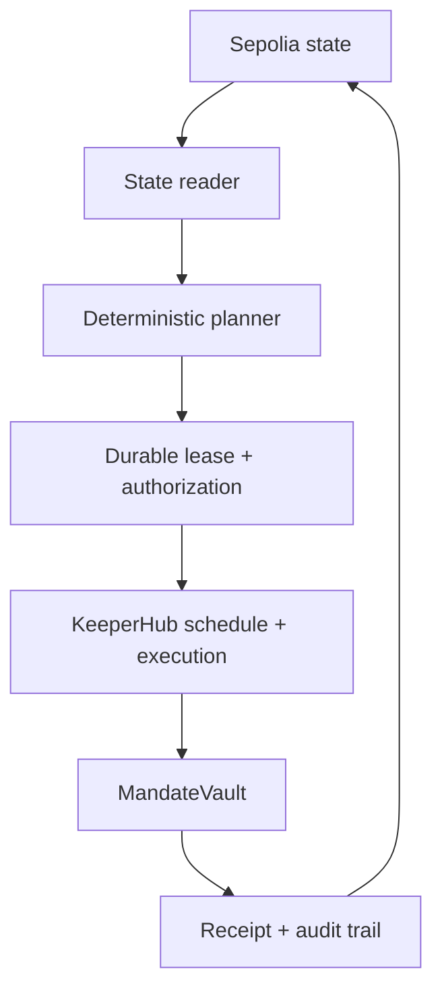

# Mandate

**Close expired onchain mandates without leaving funds, permissions, or executor authority behind.**

[Live product](https://mandate-closeout.vercel.app/) ·
[Sepolia factory](https://sepolia.etherscan.io/address/0x4977Bf6C7120b7335bA4c06e516E938FDDC6D9a5) ·
[Sepolia vault](https://sepolia.etherscan.io/address/0x63001f6B89bb212895e6f4B5c074Dc3E86B11a0a) ·
[Finalization transaction](https://sepolia.etherscan.io/tx/0x8d56a87b01af1f776dbffeded897d11dba5d5a2e8aad3d1cf8c024dea46db808)


## What it is

Mandate is an autonomous closeout agent for time-bounded DAO programs, grant
committees, and treasury working groups.

When a mandate expires, the agent:

1. settles only obligations approved before activation;
2. revokes registered ERC-20 allowances;
3. returns residual assets to the immutable treasury;
4. finalizes the mandate; and
5. removes its own executor authority.

The model never invents a recipient, changes an amount, selects a new token,
redirects the treasury, or submits an arbitrary contract call. Those boundaries
are enforced by the contract.

The self-service Sepolia beta lets a user connect a wallet, create a
factory-indexed vault they own, configure its fixed closeout policy, fund and
activate it, and sign one bounded authorization for the complete closeout.
A durable worker then advances the mandate without further wallet prompts.

## Why it exists

DAO closeouts are often treated as administrative cleanup even though they
combine custody, payment obligations, lingering permissions, signer
coordination, and public accountability.

The result can be stranded funds, slow final payments, forgotten allowances,
and temporary operators retaining authority after their work has ended.

Mandate gives that lifecycle a verifiable terminal state:

> every approved obligation resolved, every registered allowance zero, every
> tracked balance returned, and executor authority removed.

The underlying problem research and comparable-product analysis are documented
in [the build blueprint](Mandate-Closeout-Agent-Blueprint.md).

## Why KeeperHub

KeeperHub is the execution and reliability layer, not a logo added after the
agent was built.

For every closeout step, the agent:

1. reads authoritative contract state;
2. plans exactly one eligible action;
3. submits that allowlisted action through KeeperHub;
4. records the KeeperHub execution ID;
5. waits for terminal execution status;
6. re-reads chain state; and
7. advances only when the expected state transition is visible.

This makes the workflow resumable. A restart does not rely on agent memory: if
a transaction was mined, the next chain read recognizes it and prevents a
duplicate submission.

## Working Sepolia proof

The demo closes one mandate containing 1,000 mUSD:

| Step | Result | KeeperHub execution | Transaction |
|---|---|---|---|
| Settle | 250 mUSD paid to the pre-approved recipient | `jmhfrgal3z8xhr1pc7bbw` | [View](https://sepolia.etherscan.io/tx/0x48fb29c060232a1ad1f3add4516bbc535d38fc17f6e0bb1ae40da74716577fe3) |
| Revoke | allowance reduced from 100 mUSD to zero | `8cj31us7vyu51hk2mox7d` | [View](https://sepolia.etherscan.io/tx/0xebe7605565776d5017e733578e191b6fed723266ea103b11294e025c9fed476f) |
| Sweep | 750 mUSD returned to the fixed treasury | `9lj63ws2ip1mytax08efg` | [View](https://sepolia.etherscan.io/tx/0x9e7da58e07785dac5980bb03897c125c64789b59d339dddeb4dcb14c02811de0) |
| Finalize | executor replaced with the zero address | `mw6av575iv4l4ur4sqnhp` | [View](https://sepolia.etherscan.io/tx/0x8d56a87b01af1f776dbffeded897d11dba5d5a2e8aad3d1cf8c024dea46db808) |

Final state:

- required obligation: paid;
- recipient balance: 250 mUSD;
- treasury balance: 750 mUSD;
- vault balance: zero;
- allowance: zero;
- executor: zero address; and
- former-executor calls: rejected.

`mUSD` is a controllable demo ERC-20 with no monetary value. It makes balances,
allowance behavior, and the closeout sequence deterministic on Sepolia.

See [the complete deployment proof](Sepolia-Demo-Deployment-Proof.md) for
contract addresses, setup transactions, failed-run disclosure, and every
KeeperHub execution ID.

## Architecture



### Trust boundary

| Layer | Responsible for |
|---|---|
| `MandateVault.sol` | custody, approved obligations, fixed treasury, lifecycle rules, permissions, idempotency |
| `MandateFactory.sol` | user-owned vault creation, discovery, and pinned platform executor |
| State reader | reconstructing the current mandate from chain reads |
| Planner | selecting the next allowlisted action in strict order |
| Reconciler | waiting, recovering, and preventing duplicate submissions |
| Autonomous worker | one-time owner authorization, durable leases, bounded retries, and chain-state reconciliation |
| KeeperHub adapter | submitting the selected contract method with idempotency and retrieving status |
| Product surface | wallet setup and lifecycle controls; never acting as the source of truth |

### Closeout order

```text
settle required obligations
        ↓
revoke registered allowances
        ↓
sweep tracked balances
        ↓
finalize and remove executor
```

The contract blocks skipping ahead.

## Safety properties

- Required obligations only in the MVP.
- Obligation recipients, tokens, amounts, and deadlines are configured before
  activation.
- The treasury address is immutable.
- The executor has no arbitrary-call function.
- Allowance revocation uses `SafeERC20.forceApprove(spender, 0)` and verifies
  the result.
- Finalization requires all obligations resolved, all registered allowances
  revoked, and all tracked balances cleared.
- Finalization removes executor authority.
- Governance can pause the agent.
- Emergency recovery is owner-only, pause-gated, delayed, two-step, and loudly
  evented.
- After every transaction, the agent waits for a receipt and re-reads chain
  state.

## Repository map

```text
contracts/
  MandateFactory.sol     Deploys and indexes user-owned vaults
  MandateVault.sol       Contract-enforced closeout state machine
  DemoToken.sol          No-value ERC-20 used for the Sepolia proof
src/
  agent/planner.mjs      Chooses one next action
  agent/reconciler.mjs   Prevents duplicate work and handles recovery
  chain/state-reader.mjs Reconstructs authoritative state
  keeperhub/adapter.mjs  Allowlists KeeperHub contract calls
  server/                Signed execution service, persistence, and runtime
  cli.mjs                Machine-readable planner CLI
api/                     Vercel health, readiness, execution, and status routes
web/                     Judge-facing product surface
test/                    Contract, planner, reconciliation, CLI, and UI-state tests
```

## Run locally

Requirements:

- Node.js 22 or newer
- npm

```bash
npm install
npm test
npm run build
npm run dev:web
```

Then open the local URL printed by Vite.

No secret is required to inspect the source, run the tests, build the
contracts, or open the frontend.

The hosted execution API additionally requires server-only `KH_API_KEY`,
`DATABASE_URL`, and `CRON_SECRET` variables. Copy `.env.example` for local
setup. Never expose these values through a `VITE_` variable.

### Autonomous scheduler

Production uses a KeeperHub scheduled workflow as the primary trigger:

1. Schedule trigger: every five minutes.
2. Send Webhook: `POST https://mandate-closeout.vercel.app/api/autonomy-run`.
3. Header: `Authorization: Bearer <CRON_SECRET>`.

The route claims a short database lease and executes at most one deterministic
action per mandate per run. A daily Vercel cron is retained as a low-frequency
recovery trigger; it is not the primary scheduler.

### Planner CLI

```bash
npm run mandate -- plan --snapshot ./path/to/snapshot.json --json
```

The command returns a stable JSON action such as `settleObligation`,
`revokeAllowance`, `sweepToken`, `finalize`, or a typed stop condition.

Inspect a hosted autonomous mandate without exposing secrets:

```bash
npm run mandate -- autonomy status \
  --vault 0xYourVault \
  --base-url https://mandate-closeout.vercel.app \
  --json
```

### Product verification

After `npm run build`:

```bash
npm run verify:web
```

This verifies the built frontend and reads the finalized Sepolia vault. It
returns machine-readable JSON and exits nonzero if a required assertion fails.

## Tests

The suite covers:

- deployment validation;
- one-time obligation settlement;
- allowance revocation and zero verification;
- residual sweeping;
- finalization and executor removal;
- hostile authorization and ordering invariants;
- planner action order and terminal states;
- restart after mined transactions;
- terminal KeeperHub failure recovery;
- authoritative state reconstruction;
- CLI output stability; and
- judge-summary balance reconciliation.

## Honest scope

This hackathon build provides a self-service beta on Ethereum Sepolia and a
completed reference closeout using a demo token.

It does **not** claim:

- production DAO adoption;
- Safe module integration;
- compatibility guarantees for non-standard ERC-20 implementations;
- Permit2 or protocol-specific permission revocation;
- cross-chain closeout;
- autonomous governance decisions; or
- audited mainnet readiness.

Those are post-hackathon extensions, not hidden parts of the demo.

## Hackathon

Built for the
[KeeperHub Agents Onchain Hackathon](https://dorahacks.io/hackathon/agents-onchain/detail).

The submission requires a public repository, a short demo video, and a
KeeperHub-executed transaction. This repository contains the implementation and
onchain proof; the demo video will be linked here when completed.
